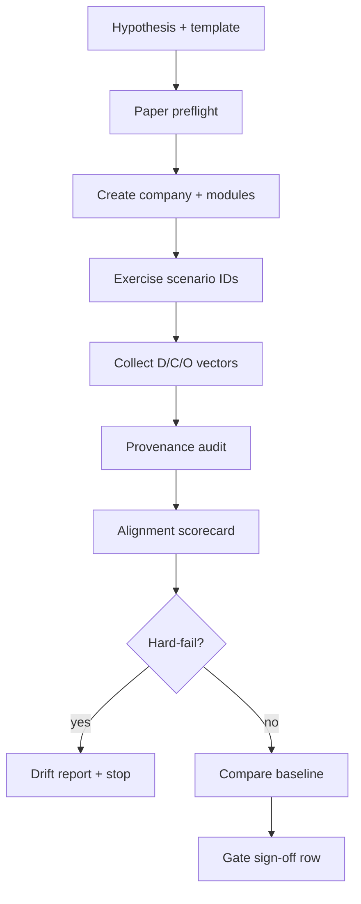

# Paper Experimentation Protocol

## Metadata

- owner: research / testing
- lastUpdated: 2026-07-17
- status: phase_1_canonical
- companions:
  - `/Users/matt-mobile/MATT/web_dev/hftr-v2/agent-docs/testing/scenario-encyclopedia.md`
  - `/Users/matt-mobile/MATT/web_dev/hftr-v2/agent-docs/testing/intent-alignment-scoring.md`
  - `/Users/matt-mobile/MATT/web_dev/hftr-v2/agent-docs/testing/philosophy-axis-taxonomy.md`
  - `/Users/matt-mobile/MATT/web_dev/hftr-v2/agent-docs/testing/requirements-matrix.md`
  - `/Users/matt-mobile/MATT/web_dev/hftr-v2/agent-docs/testing/README.md`
  - `/Users/matt-mobile/MATT/web_dev/hftr-v2/agent-docs/research/trading-philosophy-guidance.md`

## Purpose

Canonical template for **paper-only** experiments that test whether hftr-v2 behavior aligns with
declared trading philosophy and architecture — not whether a strategy is profitable.

Experiments produce audit artifacts suitable for regression baselines and gate discussions.
**Synthetic and paper feeds do not prove live microstructure behavior.**

---

## 1. Experiment record template

Copy this section for each experiment. Fill every field; use `n/a` with reason when unwired.

```markdown
### Experiment <EXP-YYYY-MM-DD-NNN>

#### Hypothesis
<One falsifiable statement about alignment or deterministic behavior — not returns.
 Example: "When philosophy declares flat-by-close and day_trading_starter template is used,
 time_stop_band resolves to min position before session close in the decision vector.">

#### Company template
- template_id: blank | day_trading_starter | trend_research_lab | multi_engine
- engine_insert: <none | engine_day_trading | engine_trend_research>
- philosophy_prompt: "<verbatim operator text>"
- goals / reinvestment: <json summary or default>

#### Modules (expected graph)
| Node name | type | setup complete? | notes |
| --- | --- | --- | --- |
| ... | ... | draft / complete | topic_sector, capital, exit |

#### Feed class
- declared: synthetic_sim | alpaca_iex_paper | kalshi_demo | polymarket_test | coinbase_sandbox
- adapter: <actual adapter id at runtime>
- entitlement_label: <must match adapter — HF-008 if not>

#### Paper-only preflight checklist
- [ ] Company `mode` = paper (UI chip confirmed)
- [ ] No live broker credentials in env for this run
- [ ] Feed class labeled honestly in module config and UI
- [ ] Catalog versions pinned (list below)
- [ ] Scenario IDs selected from encyclopedia
- [ ] Baseline `baseline_ref` identified or "first baseline"
- [ ] Operator acknowledges fund router may be topology-only (D-023)

#### Catalog version pins
- seeded-strategy-catalog: <status/version>
- session-constraint-catalog: <status/version>
- broker-policy-envelope-catalog: <status/version>
- guardrail-recovery-package-catalog: <status/version>

#### Scenario coverage
| Scenario ID | Params | executable_today |
| --- | --- | --- |
| ARCH-002 | default | yes |
| ... | ... | ... |

#### Provenance audit
- [ ] Capital allocation via `operator_input` ValueRef (if applicable)
- [ ] Target exit via `timestamp_ms` ValueRef (if applicable)
- [ ] Feed class honesty (`synthetic_sim` vs `live_feed`) — §4.1
- [ ] `simulatorGapTags` listed for non-production feeds — §4.2
- [ ] No raw numbers in assistant output (when assistant uses models — M2+)
- [ ] Feed quotes hydrate ValueRefs with correct `sourceClass`
- [ ] Lineage export attached (if calc ops ran)

#### Alignment scorecard
See [intent-alignment-scoring.md](../testing/intent-alignment-scoring.md) §5 (scorecard template) and §4 (drift report).

#### Regression baseline
- baseline_ref: <EXP-id or none>
- delta_alignment: <±0.xx>
- promotion: accept | reject | new_baseline

#### Gate sign-off
| Gate | Owner | Status | Notes |
| --- | --- | --- | --- |
| G1 M1 shell | sprint | candidate | e2e pass local |
| G2 pipeline paper trace | sprint | not_started | |
| Live enablement | master-build-plan | **blocked** | fail-closed |

#### Artifacts
- [ ] scorecard markdown
- [ ] drift report
- [ ] Playwright trace / screenshots
- [ ] API logs (redacted)
- [ ] trace bundle (when available)

#### Outcome narrative
<What was observed — deterministic effects only. No performance claims.>

#### Follow-ups
<OQ-n candidates, implementation gaps, retest date>
```

---

## 2. Preflight procedures (paper-only)

### 2.1 Environment

1. `DATABASE_URL` points to disposable Neon branch or local DB — never production live user data
   without explicit approval.
2. `DEV_AUTH_BYPASS=1` only for automated e2e — document in experiment record.
3. Provider keys: env or user keys per OQ-8; record which was active.

### 2.2 Company bootstrap

1. Create company via UI or API with chosen template.
2. Complete or intentionally skip setup per scenario (D-024).
3. Verify paper chip and operating-budget separation in top drawer.
4. Archive test companies after run (`e2e` fixture pattern).

### 2.3 Feed honesty

| Feed class | Paper realism note |
| --- | --- |
| `synthetic_sim` | Fully simulated — no broker quote semantics |
| `alpaca_iex_paper` | Paper account — no queue position / impact (tier-lever §3.8) |
| `kalshi_demo` | Demo books — not production liquidity |
| `polymarket_test` | Custody unresolved (OQ-5) — experiment only |
| `coinbase_sandbox` | Sandbox balances — not production |

Label must appear in live_api module config **and** UI.

### 2.5 Multi-company isolation

When the cohort includes **N > 1** companies:

| Check | Pass criteria | Scenario IDs |
| --- | --- | --- |
| API scoping | Every response row carries the requested `company_id` only | ISO-001, ISO-005, ISO-010 |
| Rate limits | `20/min/company` on assistant; hot company 429 does not block siblings | ISO-003 |
| LLM budgets | Exhausted budget on company A does not debit company B | ISO-007 |
| Philosophy state | `philosophyProfile` and module setup refs independent per company | ISO-002, ISO-006 |
| Queue fairness | Claim batch does not starve low-activity companies (when wired) | ISO-004 |
| Baselines | Each company gets its own `baseline_ref`; do not merge scorecards | intent-alignment-scoring §7 |

**Orchestration:** parent agent runs shared preflight once, then parallel tracks per company
(`parallel-orchestration` skill). Merge only aggregate drift statistics — never merge traces or
ValueRef handles across companies.

### 2.6 Safety stops

Abort experiment immediately on:

- Any HF-* hard-fail (intent-alignment-scoring §3)
- Unexpected live mode or live adapter selection
- Cross-company data in API response
- Unhandled console errors during UI verification

---

## 3. Execution flow



### Step detail

| Step | Action | Owner tool |
| --- | --- | --- |
| D | Run encyclopedia scenarios; parameterize N companies if ISO-* | Playwright / future runner |
| E | Snapshot declared config; export traces when pipeline exists | API + DB |
| F | ValueRef lineage + leak lint | Math module + llm package |
| G | Compute subscores | scoring spec |
| J | Promote baseline only if S_policy=1.0 and no HF-* | CI policy |

---

## 4. Provenance audit checklist (expanded)

### 4.1 Feed class honesty (`synthetic_sim` vs `live_feed`)

| Declared label | Runtime `sourceClass` | UI entitlement | Pass? |
| --- | --- | --- | --- |
| `synthetic_sim` | `synthetic_sim` or adapter `paper_sim` | "Synthetic / paper" | yes |
| `alpaca_iex_paper` | Alpaca paper adapter | Matches IEX paper string | yes |
| `live_feed` (production) | Production adapter id | SIP/prod label matches adapter | required for live claims |
| Any | Mismatch vs UI chip | HF-008 hard-fail | no |

**Rule:** never label a synthetic or paper adapter as a production entitlement. Paper experiments
default to `synthetic_sim` unless explicitly testing Alpaca paper (M4+) **or** D-122
`funds_only` with a live market quote (`live_market_quote` / `alpaca_iex_paper` feedClass on
traces with `funds_only_routing` + `inline_fill_model` gap tags — internal fill, not venue
submit).

### 4.2 `simulatorGapTags` (paper realism disclosure)

When feed class is not production, record gaps explicitly on the experiment record. Tags align with
v1 `simulatorGapTags` in seeded catalogs and tier-lever reference §3.8:

| Tag | Meaning | When to attach |
| --- | --- | --- |
| `no_queue_position` | Paper fill does not model order-book queue | `alpaca_iex_paper`, `synthetic_sim` |
| `no_hidden_liquidity` | Iceberg/hidden size not simulated | all paper feeds |
| `synthetic_price_path` | Quotes from bounded random walk, not venue tape | `synthetic_sim` (REQ-PIP-012) |
| `no_market_impact` | Participation does not move price | paper + demo adapters |
| `stale_feed_discount` | TTL enforcement may differ from production | partial M1 feeds |
| `fund_router_topology_only` | No ledger transfer despite fund-route edges | M1 default (D-023) |
| `deterministic_compile_placeholder` | Groq tier replaced by pure function | M1 promote spine |
| `philosophy_axes_partial` | `philosophyProfile` maps to levers; full band scoring unwired | until M3 lever resolver |

List active tags in the scorecard **Provenance** section. Alignment `S_provenance` may be high while
tags are non-empty — tags document **simulator honesty**, not failure.

### 4.3 Row checklist

| # | Check | Pass criteria |
| --- | --- | --- |
| P1 | Financial qty/price in traces | All via ValueRef handles |
| P2 | Operator form numbers | `operator_input` sourceClass |
| P3 | Band positions | `band_seed` or lever resolution — no floats in model JSON |
| P4 | Clock reads | Injectable clock module only |
| P5 | Session boundaries | Market calendar service — not model text |
| P6 | Feed TTL | Stale quotes veto entries |
| P7 | Catalog lineage | `catalog_version` in control snapshot |
| P8 | Assistant (M1) | Read-only lookups only — no model numerics |
| P9 | LLM stages (M2+) | Leak lint per call |
| P10 | Idempotency | Replayed jobs do not duplicate side effects |

---

## 5. Regression baseline protocol

1. **Establish:** first passing paper experiment per `(template_id, feed_class)` tuple with
   documented scenario set.
2. **Store:** `baseline_ref` metadata JSON with D_hash and catalog pins.
3. **Compare:** each subsequent run produces drift report §4 deltas.
4. **Reject promotion when:**
   - alignment drops >0.05 without documented intent change
   - new HF-* or S_policy regression
   - catalog version bump without migration notes
5. **Live:** requires separate baseline + master-build-plan gate — paper baseline never suffices.

---

## 6. Gate sign-off matrix (Phase 1)

| Gate | Criteria | Experiment may claim |
| --- | --- | --- |
| M1 shell | Canvas, setup, paper UI, e2e | ARCH-*, ISO-003/005/007, LIVE-001, NRA-007/008 |
| M2 paper trace | End-to-end promote → fill trace | ORD-*, MKT-* (paper) |
| M3 training replay | Replay hash match | DATA-012 |
| Live | Checklist in master-build-plan | LIVE-003+ only |

Sign-off row in experiment record must cite **verification commands run** (e.g. `pnpm test`,
Playwright spec names). Unverified claims → mark `not_verified`.

---

## 7. Example minimal experiment (runnable today)

**EXP-2026-07-17-demo**

- **Hypothesis:** Day trading starter template renders full topology with paper mode and
  operating budgets separate from trading capital.
- **Template:** `day_trading_starter`, skip setup then complete trading node inline.
- **Feed class:** `synthetic_sim` (configured on template; adapter not executing in M1).
- **Scenarios:** ARCH-002, LIVE-001, NRA-007, NRA-008, Q-008.
- **Preflight:** paper chip visible; DEV_AUTH_BYPASS for CI only.
- **Provenance:** PATCH module returns allocation + exit refs.
- **Scorecard:** S_policy 1.0 for UI truthfulness; S_axis n/a (no levers); alignment partial.
- **Baseline:** first for ARCH-002 e2e path.
- **Gate:** G1 candidate per D-022 — not formal sign-off.

Command: `pnpm --filter web exec playwright test apps/web/e2e/company-workspace.spec.ts`

---

## 8. Anti-patterns (forbidden)

- Claiming alpha or "worked well" without alignment evidence
- Using paper fill quality as live slippage proof
- Widening immutable guardrails "for testing"
- Skipping feed class labeling
- Live mode toggle tests without gate checklist
- Deleting drift reports when score regresses
