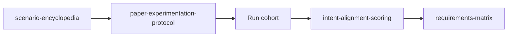

# hftr-v2 Testing & Intent Alignment

Living documentation for verifying that shipped code matches product, architecture, and safety intent — especially the **paper trading loop** and M1 surfaces.

**No guaranteed returns.** Alignment testing measures declared-vs-observed behavior under constraints, not profitability.

## Documents

| Document | Purpose |
|---|---|
| [requirements-matrix.md](./requirements-matrix.md) | Human-readable requirements → evidence matrix (grouped tables, doc-drift callouts) |
| [requirements-matrix.json](./requirements-matrix.json) | Machine-readable matrix (`version`, `generatedAt`, `requirements[]`) for CI gates, coverage dashboards, and agent tooling |
| [scenario-encyclopedia.md](./scenario-encyclopedia.md) | Phase-1 deterministic scenario classes (`ISO-*`, `ARCH-*`, `PHIL-*`, …) for alignment regression |
| [philosophy-axis-taxonomy.md](./philosophy-axis-taxonomy.md) | Operator philosophy axes mapped to catalog bands and `LeverSetting` |
| [intent-alignment-scoring.md](./intent-alignment-scoring.md) | Multi-objective alignment scoring model (behavior vs declared intent, not PnL) |
| [experiment-log.md](./experiment-log.md) | Append-only paper cohort scorecards (EXP-*) |

## How to use with `/paper-experiment`

The Cursor **`/paper-experiment`** command and `.cursor/skills/paper-experiment/SKILL.md` implement a fail-closed paper-only cohort workflow. Use this directory as the **verification spine**:

| Step | Skill / command | Testing doc |
| --- | --- | --- |
| 1. Pick scenarios | `/paper-experiment` §1 scenario brief | [scenario-encyclopedia.md](./scenario-encyclopedia.md) — choose IDs with `executable_today` yes/partial |
| 2. Preflight | Paper-only checklist (abort on live path) | [paper-experimentation-protocol.md](../research/paper-experimentation-protocol.md) §2 |
| 3. Declare axes | Philosophy prompt + `philosophyProfile` sliders | [philosophy-axis-taxonomy.md](./philosophy-axis-taxonomy.md); [trading-philosophy-guidance.md](../research/trading-philosophy-guidance.md) |
| 4. Run + collect artifacts | Playwright, API, traces | Encyclopedia **Evidence artifact** column |
| 5. Provenance audit | `synthetic_sim` vs `live_feed` honesty, `simulatorGapTags` | Protocol §4; [number-handling.md](../architecture/number-handling.md) |
| 6. Score alignment | D/C/O vectors, subscores, HF-* | [intent-alignment-scoring.md](./intent-alignment-scoring.md) |
| 7. Regression + gates | Baseline compare, G1–G3 sign-off rows | Protocol §5–6; matrix `status` column |
| 8. Close-out | `intent-alignment-audit` skill; curate docs | Update matrix row `evidence` when status changes |

**Multi-company cohorts:** run ISO-* scenarios per company in parallel (parent agent orchestrates; one sub-agent track per company after shared preflight). Never share `baseline_ref` across companies — compare within-template only.

**Honesty defaults:** synthetic paper loop stages may be `implemented` while live brokers remain `deferred`. Mark unwired pipeline claims `not_collected` on scorecards (scoring doc §6).

## Matrix schema (JSON)

Each requirement row:

| Field | Description |
|---|---|
| `id` | Stable REQ ID (e.g. `REQ-PIP-007`) |
| `title` | Short capability name |
| `source` | Canonical spec path (product, architecture, ui-spec, plan milestone, or code path) |
| `status` | `implemented` \| `stub` \| `doc-only` \| `deferred` |
| `evidence` | Code paths, migrations, tests, or APIs proving current state |
| `scenarios` | Verification scenarios (vitest, Playwright, manual browser flows) |
| `venues` | `paper_sim`, `alpaca`, `kalshi`, `polymarket`, `coinbase`, `platform`, `all` |
| `philosophyAxes` | Taxonomy axis families (see philosophy-axis-taxonomy.md) and/or multi-objective framing |
| `safetyClass` | `safety_critical`, `compliance`, `financial`, `operational`, `informational` |
| `notes` | Optional — includes explicit **doc-drift** flags when specs claim coverage that code/tests lack |

## Status honesty (paper program)

- **M2–M6** milestone items → `deferred` unless a narrow slice is already landed (then `stub` with honest notes).
- **Synthetic paper loop** (`research.curate` → `trend.scan` → `trend.promote` → `dispatch.paper_trade`) → `implemented` / `stub` per stage (deterministic placeholders labeled).
- **Live brokers, Stripe billing, galaxy, Mistral chat** → `deferred`.
- **Doc-drift** — flagged in `summary.docDriftFlags` and row `notes` (e.g. Playwright flows 1/3/7 not covered; M3 “≥294 tests” not met).

## Related specs

- Product: `agent-docs/product/product-spec.md`
- UI flows: `agent-docs/ui-ux/ui-spec.md` §7
- Architecture: `agent-docs/architecture/`
- Milestones: `agent-docs/plans/master-build-plan.md` (read-only for matrix harvest; matrix does not edit the plan)
- Paper protocol: `agent-docs/research/paper-experimentation-protocol.md`
- E2E: `apps/web/e2e/`

## Maintenance

Regenerate or extend the matrix when:

1. A milestone gate closes (update `deferred` → `implemented`).
2. New API routes or engine handlers ship.
3. Playwright coverage changes (update `scenarios` and doc-drift flags).
4. Specs claim verification that tests do not perform.

Bump `generatedAt` and keep `requirements-matrix.md` summary counts in sync with JSON.
